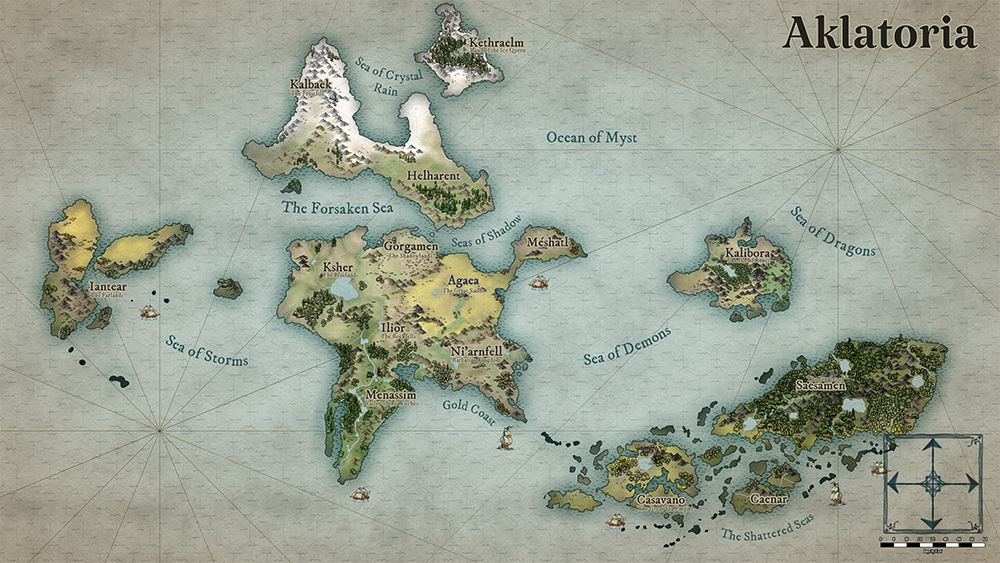

# The Realms of Aklatoria

## Map of the world

[Aklatoria.png](../assets/images/maps/Aklatoria_main.png){: .footnote .right}

## Realms
- [Agaea](./realms/agaea.md), the White Sands of the Dragon Lords
- [Caenar](./realms/caenar.md)
- [Casavano](./realms/casavano.md)
- [Halherant](./realms/halherant.md)
- [Iantear](./realms/iantear.md), the Farlands
- [Ilior](./realms/ilior.md), the Rockfells, Kingdom of the Sky
- [Kalbaek](./realms/kalbaek.md)
- [Kalibora](./realms/kalibora.md), the Dwarven Homeland
- [Kethraelm](./realms/kethraelm.md), Land of the Ice Queen, the Frozen Jungles of the High Moons
- [Ksher](./realms/ksher.md), the Kingdoms of the Towers, the Freelands
- [Menassim](./realms/menassim.md), Valley of the Witches
- [Meshatl](./realms/meshatl.md)
- [Ni'arnfell](./realms/niarnfell.md), the Barbarian Kingdoms
- [Saesamen](./realms/saesamen.md), the Jungles of
