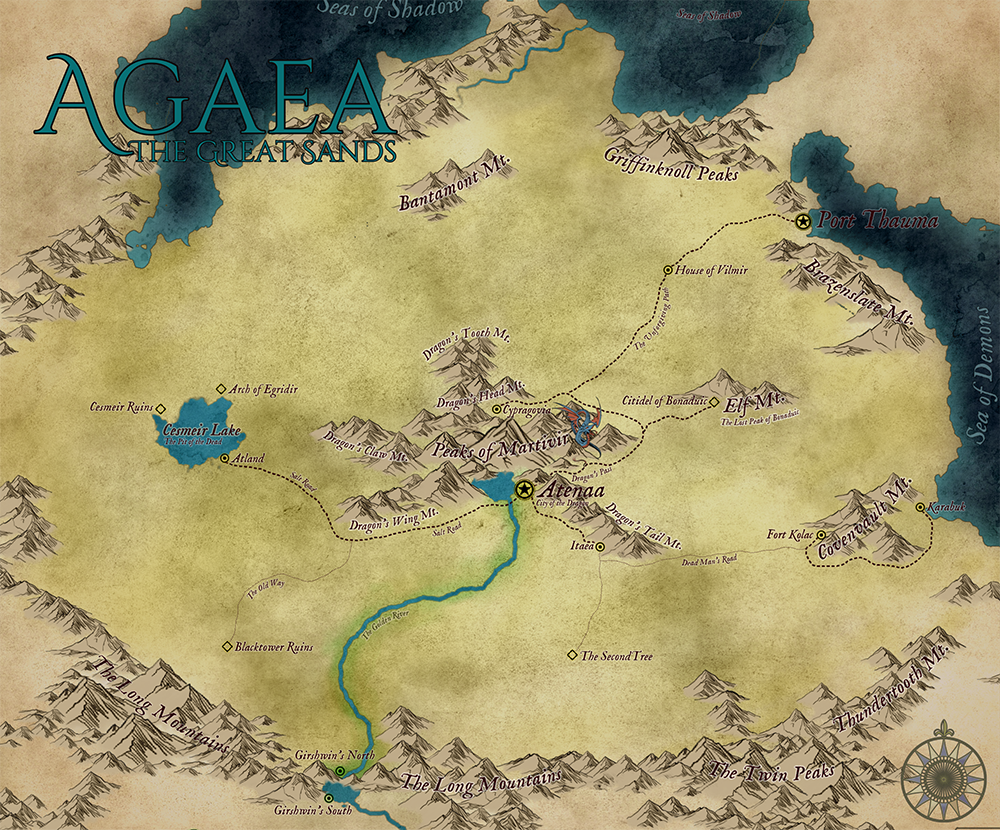

# Agaea
## The Great Desert {: .subtitle}

[Agaea.png](../../assets/images/maps/Agaea.png){: .footnote .right}

> Ancient, vast and unforgiving.  The Great Sands stretch across the map as far as the eye can see.  It is an unforgiving land, breeding unforgiving people.  Its settlements ancient remnants of a forgotten age.  Its culture deep, with bloodlines far reaching.  The great City, Atenaa - The Jewel of the Dessert, The City of Dragons, at its core.

## Geographical Locations
### Peaks of Martivir
The Peaks of Martivir lies at the center of the Agaean sands.  At its center, the great mountains on which Atenaa is built.  Four great ranges stretch across the sand, each named after a part of the Dragon.

|Settlements|Size|Political Align.|
|:--|---|---|
|[Atenaa](../../settlements/agaea/atenaa), the City of Dragons|Metropolis|Theocracy|
|[Itaea](../../settlements/agaea/itaea)|Town|Theocratic Regeancy|
|[Cypragovia](../../settlements/agaea/cypragovia)|Town|Theocratic Regeancy|

### Covenvault Mountains
To the East lies the Covenvault mountains.  In antient times it served as a Dwarven foothold on Agaea.  Various burrows and minor forts long since abandoned are scattered along its roots, with Fort Kolar and Karabuk being a gateway of trade across the Sea of Demons.  Ruthlessly handled by their honoured and unbiased matriarch.

|Settlements|Size|Political Align.|
|:--|---|---|
|[Fort Kolar](../../settlements/agaea/fort_kolar)|Dwarven Fort|City State|
|[Karabuk](../../settlements/agaea/karabuk)|City|City State|

### Cesmeir Lake
To the West lies Cesmeir Lake.  Nothing lives in the deep waters, its water undrinkable and barren.  Once, long ago, it had life – with ancient ruins standing as testament to its splendour.

|Settlements|Size|Political Align.|
|:--|---|---|
|[Atland](../../settlements/agaea/atland)|City|City State|

Notable Locations

??? abstract "Arch of Egridir"
    This ancient Elf ruin lies to the North of Cesmeir lake.  Gigantic, cracked Ironwood arches line the abandoned cobblestone roads, walled in white marble.  It is said that the spirits of fallen Elf warriors haunt the empty shell and that the full crest of Nox, strange, alien things walk the streets.

    Legend has it that there are still treasures hidden deep within the marble walls, but the fools who seek it often return traumatized, flailed and in some cases insane.

??? abstract "Cesmeir Ruins"
    On the far side of the barren lake lies the ruins of a long forgotten city.  Buried almost completely, the tops of stone structures peek out in between the shifting dunes.  A multitude of different scavengers has taken up residence in the sunken city, nesting in the many hidden corners of the ruins.

    At the centre of the ruin sits a tall, protruding tower.  No one truly knows what lies inside, or what creeps in the caverns under the sand.

### Elf-Lands
The areas to the North of the Peaks of Martivir is commonly known as the Elf-lands, because it is most commonly populated by the Elven tribes of Agaea.

|Settlements|Size|Political Align.|
|:--|---|---|
|[Port Thauma](../../settlements/agaea/port_thauma)|Metropolis|Kraterocracy|

Notable Locations

??? abstract "House of Vilmir"
    An oasis in the scorching sand, the House of Vilmir is a refuge on the way to the North.  Gardens, canals, palm trees and open baths, with lounging even maidens offering pleasures and company is a common site.

    Vimir is a mysterious figure, that no one has seen in a few centuries.  His house is a sanctuary of sorts, respected by the Elf lords of the North as well as the High Judicator, even though he forsook the ways of his kin to become a pacifist and sage.

## The Shifting Sands
The desert sands that fall outside the major inhabited regions of Agaea are referred to as The Shifting Sands. It is considered wilderness and only the most adept at desert travel are able to navigate these lands. Many things are hidden by the scorching heat and lack of water.

Notable Locations

??? abstract "Blacktower Ruins"
    The broken tower protrudes from the sand like a lonesome, crooked finger.  Black scorches line the outside as seen from afar.  The old road leading to the tower remains in use, as pilgrims take the journey to strange site every year at the summer solstice.

    Yet no one has been able to enter the tower for as long as history records.  Its origin and the reason for its burnt walls remain lost to the ages.

??? abstract "Citidel of Bonaduic"
    Eons ago, when Agaea was still vibrant with life, Bonaduic was the capital of the realm.  The ancient Elf magic that carved it into the mountainside makes for a marvelous splendor of art and skill.

    Some of the opened halls have been reclaimed and now house mostly scholars and priests, seeking the knowledge of the past.

??? abstract "The Second Tree"
    Simply named “The Second Tree” after the resemblance to the Hollow tree inside Atenaa, the strange site offers up no answers to its origin.

    A worn, broken trunk, almost forty feet in diameter and a hundred feet high, the dead tree stands in the open wind, and under the stars.  The only hint of civilization is a faded, crumbling stairway leading up to the tree.

    Who knows what secret placed it there?  Who knows what stories remain untold of its death?
