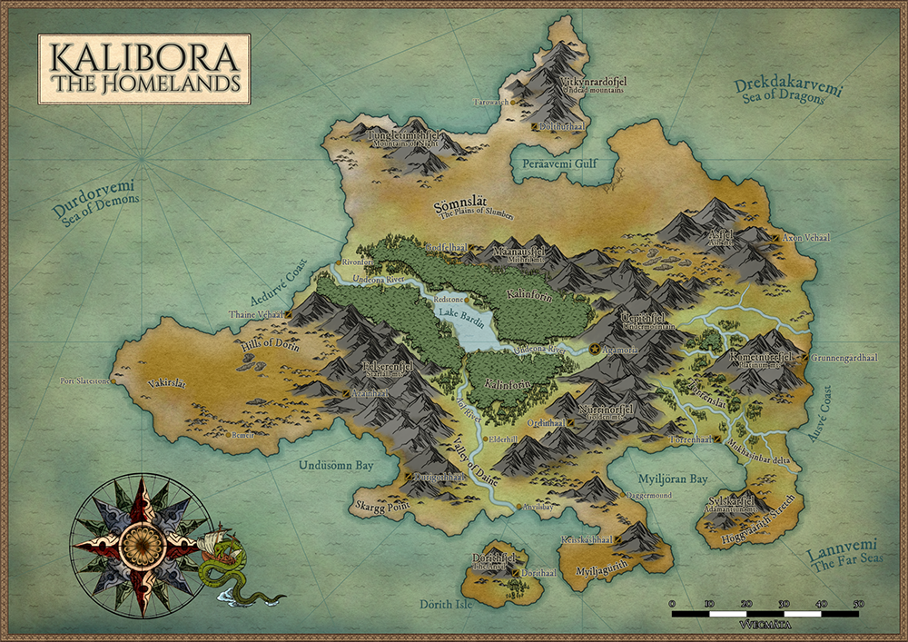

# Kalibora
## The Dwarven Homelands {: .subtitle}

[---.png](../../assets/images/maps/kalibora.png){: .footnote .right}

> Across the Sea of Demons, far from the new lands of Aklatoria, lies the Origin of the Dwarven Imperium. Vast and mountainous is the land, its surface dormant and empty, but its caverns bustling and grand. Daughter of the land, the great river _Undeona_ carves a path through the wild forest basin of _Kalinforin_. It reaches to the Great Undermountain, the Hold of Agamoria, capital of the Dwarven Kingdoms and home of the Living Paragons.

## Culture
The [People of Kalibora](/people/by_region/__)

## Geographical Regions
### Area
#### Notable Locations

## Organizations