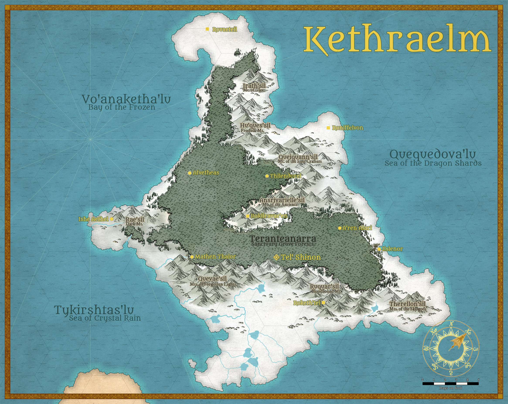

# Kethraelm
## Land of the Ice Queen {: .subtitle}

[Kethraelm.jpg](../../assets/images/maps/Kethraelm.jpg){: .footnote .right}

> Silent and serene is the lands of frost and snow. From the frozen lakes in the south to the tundra plains in the north, Kethraelm lies motionless. But deep within the caverns, and under the canopies of the boreal forests, there much is life. Civilization lies there in the secret places, and those who dwell their know its vast riches and the authority that claims the land.

## Culture
Kethraelm is claimed by Elven nationalists as sovereign and all others who dwell there ascribe to this ideology. It is a harsh land, breeding harsh people, and only the strongest can truly thrive here.

Travel is freely allowed, for trade and news, but the laws of Tel'Shinon are absolute. [Vonryl Kethalon](../../religion/deities/vonryl_kethalon.md) is proclaimed as the divine patron for the realm and all who dwell within, and as such the laws of the sovereign include her reverence.

## Geographical Regions

### The Reach
The southern reaches of Kethraelm are filled with frozen streams and lakes, surrounded by vast, hilly tundras. By all accounts, the lands are mostly empty, though the _Riverways_, as the ice roads are called, often see travellers traversing the harsh trek to Tel'Shinon and back, adding to the already perilous journey the threat of banditry.

|Settlements|Size|Political Align.|
|:--|---|---|
|[Roketh'tel](../../settlements/kethraelm/rokethtel)|||

Notable Locations

??? abstract "Quevae'sil"
    The Mountains of Forgotten lights lies to the west of the Reach. Impassible and impenetrable it stands. Adventurers seeking glory often die on its slopes, in search of the legendary Fire Orbs that can sometimes be seen alight at its far peaks on a clear night.

??? abstract "Ruquar'sil"
    Venturing into the Bloodbound Mountains is all but forbidden. Dark creatures dwell in its caverns. But the strongest followers of Vonryl Kethalon frequently brave the forbidden paths to pilgrimage to Roketh'tel.

??? abstract "Therellon'sil"
    At the far eastern end of the Reach lies the Mountains of the Sky gods. It is removed from all civilization and see little travel. It is rumored that a number of large Orc bands have settled there, as the eternal storms raging at the peaks are to them a sign of Tor about to reclaim part of the Ice Kingdom.

### Teranteanarra
The Teranteanarra is more than a boreal forest grove, it is a frozen jungle filled with ancient secrets.It stretches for leagues, growing as one, covering the Land of Ice and giving the inhabitants a haven from the sleet and storm. To say that it is safe, however is a grave mistake, though civilization exist here. From the Elven capital of Tel'Shinon, to the furthest point in the Frozen Bay, The Grove belongs to the Elves, and wary be those who tread without being invited.

|Settlements|Size|Political Align.|
|:--|---|---|
|[Tel'Shinon](../../settlements/kethraelm/telshinon)|Metropolis|Divine Monarchy|
|[Mathen Thalor](../../settlements/kethraelm/mathen_thalor)|City|Tel'Shinon County|
|[A'ren Aleri](../../settlements/kethraelm/aren_aleri)|City|Tel'Shinon County|
|[Ilslenor](../../settlements/kethraelm/ilslenor)|City|Tel'Shinon County|
|[Afvetheas](../../settlements/kethraelm/afvetheas)|City|Tel'Shinon County|
|[Thilendorei](../../settlements/kethraelm/thilendorei)|City|Tel'Shinon County|

### Tykir'lun
To the west, the coast of Tykir'lun gates the Sea of Crystal Rain. But its jewel is that of Ishe Aethel. From the frozen wastes the Holy City rises from the stone at the foot of the Dark mountains. A testament to the power and glory of Vonryl Kethalon and her Temple of the Final Winds.

|Settlements|Size|Political Align.|
|:--|---|---|
|[Ishe Aethel](../../settlements/kethraelm/ishe_aethel)|Metropolis|Tel'Shinon County|

### Shards of the Dragons
To the north and west are the Shattered Lands, the Shards of the Dragons. Where Kethraelm is inhospitable, the Shards are outright hostile. There used to be a Dragon Kingdom up in the mountains central to the greater realm lands, but they were banished from there in eons past.

|Settlements|Size|Political Align.|
|:--|---|---|
|[Rokiiravae'en](../../settlements/kethraelm/rokiiravaeen)|City|Tel'Shinon County|
|[Roniffelvon](../../settlements/kethraelm/roniffelvon)|City|Tel'Shinon County|
|[Rovaeteil](../../settlements/kethraelm/rovaeteil)|City|Tel'Shinon County|

Notable Locations

??? abstract "Ansrivarielle'sil"
    The Mountain of the Ancients, the land of Lost Memories. From the heart of Kethraelm rises this great mountain rance. Now claimed by the servants of Vonryl Kethalon, ruins suggest this was once a High Kingdom of Dragon kind.

??? abstract "Queiquann'sil"
    The Artisan mountains, The Peaks of the Lost Crafters stands dormant. Legends say there's riches under the mountain, and speak of a lost civilization that the land swallowed in a previous age.

??? abstract "Hu'ques'sil"
    Tribes and families that live according to the Old Ways reside under the Hu'ques'sil. It is dangerous, even for Elves, to venture into its shadow. ts inhabitants thirst for blood and sacrifice.

??? abstract "Irath'sil"
    The Peaks in the North, the Mountains of Glee. Molten rock spew from its sides to melt the frozen land around it. It is a place of inflection and spirituality. An antithesis to the Lady of The Winds.
