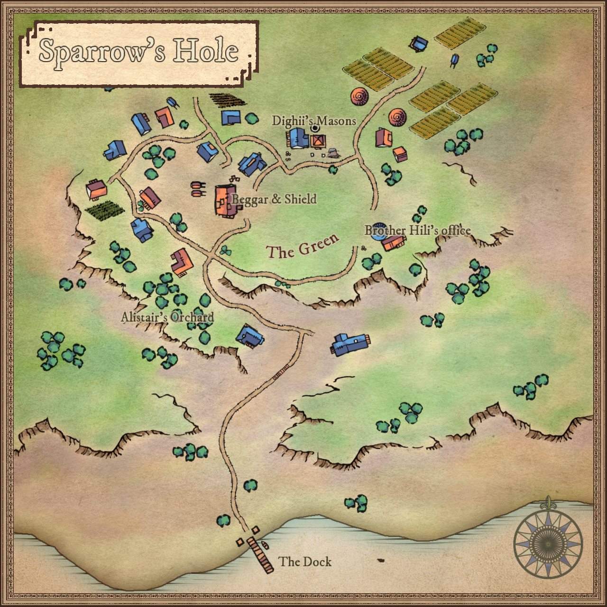

# Sparrow's Hole
> From a small, single dock on what seems like an abandoned beach, a narrow dirt road snakes up the side of the steep, grass hills. As you rise above the crest, before you lies a quint little town. Simple folk making an honest living off the land, offering lodgings for passing travellers.

!!! info "Details"
    - **Location:** [The Pheagas Rise, Ni'arnfell](../../../realms/niarnfell#the-pheagas-rise), 
    - **Politics:** Self Governed, affiliated to the Narr Confederacy
    - **Alignment:** Lawful Good
    - **Population:** 49 - _Human (32), Half-Orc (12), Dwarf (4), Gnome (1)_
    - **Authority:** Brother Hili, a Human male, cleric of Naásh Feramil _(Mayor)_; Dighii Cromwell, a Human male mason and armorer _(Captain of the Militia)_

## Notable Sites

??? abstract "The Green"
    At the centre of town there is a large field of grass, named _The Green_ by the townsfolk. It is a place for community gatherings, birthdays, weddings, feasts, and holy days alike. From this square, the whole of the town is visible and you have a clear view of all the establishments.

??? abstract "Dighii's Masonry"
    Nested inside what seems like a druidic standing stone cluster is a sturdy stone building. Its one wall opens to The Green to show the very well maintained and supplied workshop inside. Dighii manages his business from here, mainly masonry work, but as an amateur armorer he also crafts and maintain the arms for the town's militia - a necessary institution here at the edge of the _Pheagas Rise_.

??? abstract "The Beggar and Shield"
    On the Western edge of the green stands the biggest building in town, a two story stone building decorated with small gargoyle sculptures on the roof beams. It is the Beggar and Shield - tavern and inn to the infrequent travellers that take up rest. Where the rest of the town has mostly straw roofs, the inn has baked tiles. It is run by a Dwarf named Grakilm Mountainriver , master brewer and teller of tales.

??? abstract "Alistair's Orchard"
    Entering the town from the lonely dock, one sees a neat plantation of fruit-bearing trees. Planted on the side of a cliff-like incline, it is owned and maintained by Alistair Cromwell, father of Dighii and one of the town elders.

??? abstract "Brother Hili's Office"
    On the far side of the green is a small chapel dedicated to [Naásh Feramil](/religion/deities/naash_feramil). Attached to the chapel is a small office and residence of the town's mayor, Brother Hili.

## Surrounding Area
The plains surrounding Sparrow's hole is considered untamed wilds, as most of the _Pheagas Rise_.  Ruins and caves are scattered, many of which have never been seen by the current inhabitants.

??? abstract "Castael's Shack"
    A few leagues outside of town lives an Elf Hermit named Castael. His small, log cabin sits on a steep outcropping, where a winding path circles down to the grasslands below. From its perch, the hermit and his visitors can see far across the wilds.

??? abstract "The Pit of Kaerlun Kreepmaster"
    Some ways to the North, the earth rises to a steep ridge that forms part of the plateau of the _Pheagas Rise_. Before two smooth stone walls stands a known druidic circle of Ironbark, no longer used, but still containing some of the original enchantments.  It is said that the spirits of nature guard the stones. Next to it are round pools of clear water, seemingly formed by swirling streams in ancient times.