# Neliavth
## The Ancients, ascended {: .subtitle }

The Neliavth is the group name for an ancient race (or possibly a collection of variant sub-races), who lived in times before reckoning.  Throughout the land of Aklatoria, their remnants and ruins are scattered, some holding the secrets of ages long forgotten.

## Literature and Knowledge
The language of the Neliavth is named [Vestii](../../../language/vestii) - a logophonetic system akin to cuniform, with some additional symbols that were used for common words or specific meanings.  Their mathematical system is 12 base, using unique symbols as count indicators and other symbols indicating the major intervals of 12, along with specific ways to indicate advanced operators such as multiplication or powers.

Their legacy is one of obscure and illogical magics, as well as advanced clockwork inventions. Most of the ruins that have been found indicate no residential purposes, but rather the pursuit of some experimental magical or inventive goal.  These are often so otherworldly and foreign that modern day scholars never find out its true purposes.  Especially since no coherent link between the purposes of these facilities can be found.

## Cultures
The name Neliavth was not given to the society by modern scholars, but rather, it was discovered as a term used by the ancients to refer to themselves.  From various sources there seems to have existed at least four different factions within this society. Often the references to these seem so distinct that it is believed that they might even have been of different species or at least sub-variants of the same race.

The four factions identified were named by the Neliavth as, the:

* **Lauraninth** ({: .vestii-symbol .small}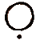{: .vestii-symbol .small}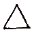{: .vestii-symbol .small}{: .vestii-symbol .small}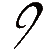{: .vestii-symbol .small}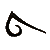{: .vestii-symbol .small}) - Translated as the _"Tribes"_, and believed to be the first of the Neliavth cultures to emerge.
* **Ameth** ({: .vestii-symbol .small}{: .vestii-symbol .small}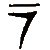{: .vestii-symbol .small}{: .vestii-symbol .small}) - Translated as _"Warriors"_, and believed to have been a warlike faction that splintered from the _Lauraninth_.
* **Vestath** (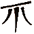{: .vestii-symbol .small}{: .vestii-symbol .small}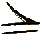{: .vestii-symbol .small}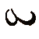{: .vestii-symbol .small}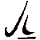{: .vestii-symbol .small}{: .vestii-symbol .small}) - Translated as _"Empire (dwellers)"_, and believed to have been the culture responsible for most of the ruins found in the modern day.
* **Ethdarin** ({: .vestii-symbol .small}{: .vestii-symbol .small}{: .vestii-symbol .small}{: .vestii-symbol .small}{: .vestii-symbol .small}{: .vestii-symbol .small}{: .vestii-symbol .small}) - Translated as _"Risen"_, with only a few references found to them, they are thought to be the culture responsible for the Vanishing of the Neliavth from Aklatoria. 

## Religion
References to higher beings are common in Neliavth sources.  They seem to have had a trilinear belief system, but with a monotheistic focus on one creator-god.  These beings are references in Vestii as Yuahijo ({: .vestii-symbol .small}{: .vestii-symbol .small}{: .vestii-symbol .small}{: .vestii-symbol .small}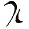{: .vestii-symbol .small}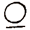{: .vestii-symbol .small}).

This creator is referenced as **"Aevum"**, personified as creation itself. Aevum had two faces, one of chaos and one of order, but his being, according to the Neliavth writings had three parts.  _"Stasis"_ (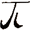{: .vestii-symbol .small}) was his one face, the face of order. _"Chaos"_ ({: .vestii-symbol .small}{: .vestii-symbol .small}) was his other face, the face of entropy. Lastly, was _"Substance"_ ({: .vestii-symbol .small}), the power within him giving life to creation.

Though Aevum was the primary god of the Neliavth, there are references to more Yuahijo (elder gods) known.  One called **"Shael"**, referenced as the god of the Stars, as well as **"Ränn"**, the god of terror and antithesis to Aevum.  Of Ränn is known the second most, also with a being of three. His being consisted of _"Entropy"_ ({: .vestii-symbol .small}{: .vestii-symbol .small}), _"Hate"_ (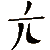{: .vestii-symbol .small}{: .vestii-symbol .small}{: .vestii-symbol .small}), and _"Darkness"_ ({: .vestii-symbol .small}{: .vestii-symbol .small}{: .vestii-symbol .small}{: .vestii-symbol .small}).  But references to his liking have not yet been found.

Though knowledge of the Neliavth religion is rare amongst the modern scholars, those who have studied the ancients believe that these entities, or "Elder Gods", are associated to the [Void](../../cosmology/planes/void_of_creation) at the end of Space and Time.

## Disappearance
Throughout Neliavth writings are references of disappearance, and the concept seems to play a significant role in their society.

The first mentioning of disappearance is in reference to their gods. According to Neliavth myth, at some point in their history, around the time the Ameth faction spilt from the major society, perhaps a short time before it, their god Aevum retreated into the Void he came from before creating the universe.  Reasons for his retreat varies from source to source, but most prominent found in the [Book of Arath Aev](../../artifacts/book_of_arath_aev), stating that he grew disappointed with his creation.

The second reference and defining element of Neliavth culture is of the disappearance of the Neliavth themselves.  In the last chapter of the Book of Arath Aev, it is noted that the Ethdarin had to make the ultimate sacrifice during a war with the ancient dragons.  Their action is what caused their disappearance, but also their salvation.

Many theories exist about what these references mean, including the mundane and the farfetched. Some examples say the Neliavth caused a great extinction and thus an age of peace before the lower races became aware.  Others believe the Neliavth ascended through hidden rituals and they came to personify the deities of the modern world.